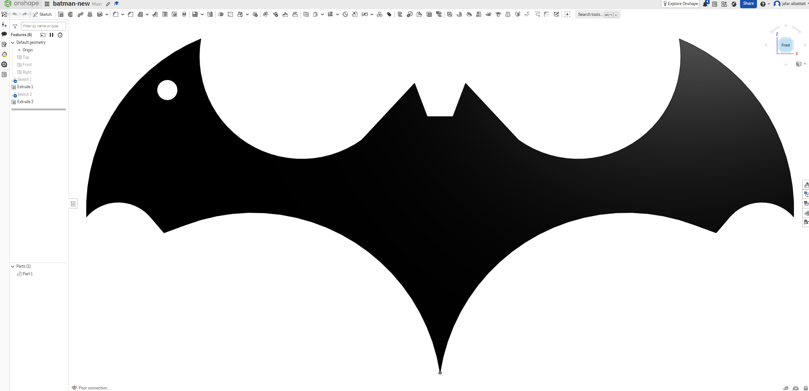

Batman Keychain 3D Design (Onshape) 🦇

This project is a practical application of Computer-Aided Design (CAD) using **Onshape**. The goal of this task was to sketch and extrude a custom keychain shaped like the iconic Batman logo, making it fully ready for 3D printing.

## 🧠 Design Process (Onshape)

The 3D model was created entirely in the cloud using Onshape by following these steps:

1. Opened a new document in **Onshape** and started a new **Sketch** on the Front plane.
2. Designed the outer profile of the Batman logo using sketching tools to get the accurate curves and sharp edges.
3. Added a small circular cutout (hole) on the upper left wing to serve as the keyring attachment point.
4. Applied the **Extrude** feature (`Extrude 1`) to give the 2D sketch a solid 3D thickness.
5. Refined the design (utilizing `Sketch 2` and `Extrude 2` as seen in the feature tree) to finalize the solid body.

---

## 📁 Project Assets
* **Live 3D Model:** [View the Onshape Document Here](https://cad.onshape.com/documents/8a2a181d525263cbbde77a5e/w/6a4d7c5a7465768ddd3bf215/e/f5b1eac7788ff35c074ce1b0?renderMode=0&uiState=6a74dfaf58da964de8c94011
)
* `image_8d6273.png`: A screenshot showing the completed CAD model and the feature tree in the Onshape workspace.

## 🛠 Prerequisites
To view, edit, or 3D print this project, you will need:

* **To View/Edit:** A modern web browser (no software installation required). A free Onshape account is recommended if you wish to clone and modify the design.
* **To 3D Print:** Slicing software (e.g., Ultimaker Cura, PrusaSlicer) and access to a 3D Printer.

## 🚀 How to View and Export
1. Click the project link in the **Project Assets** section to open the workspace in your browser.
2. Use your mouse to pan, zoom, and rotate to inspect the 3D model.
3. **To download for 3D printing:**
   * Navigate to the **Parts** section on the bottom left corner (e.g., `Part 1`).
   * Right-click on the part.
   * Select **Export**.
   * Choose your preferred 3D format (typically **STL** or **3MF** for 3D printing) and click Export.
4. Import the downloaded file into your slicing software, generate the G-code, and start printing!

## 📊 Results
The final output is a clean, solid 3D CAD model of the Batman symbol, properly constrained and extruded. It features a built-in mounting hole, making it perfectly optimized to be manufactured as a physical, real-world keychain.
